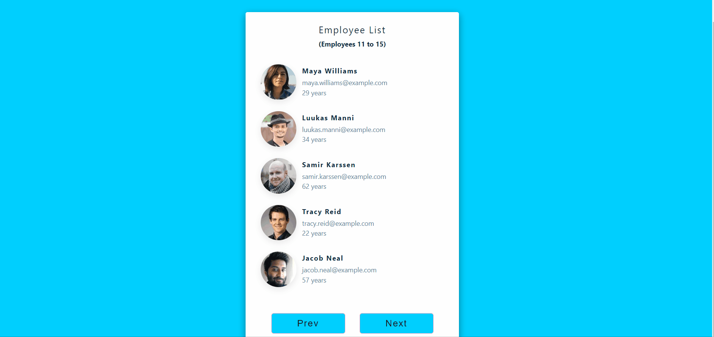

# Employee
This project is a simple website created using React.
## Screenshots
 

[Employee Live Page](https://listemployee.netlify.app/)
## Description
I used a mock API on this website.
In the project directory, you can run:
### `npm start`
Runs the app in the development mode.\
Open [http://localhost:3000](http://localhost:3000) to view it in your browser.
